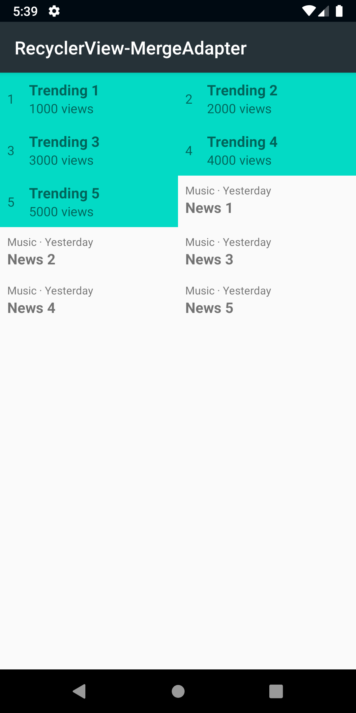

# RecyclerView-MergeAdapter

The main goal is to practice [RecyclerView MergeAdapter](https://developer.android.com/jetpack/androidx/releases/recyclerview#version_120_2) 
a new RecyclerView Adapter that can combine multiple adapters linearly.

## Sample

**LinearLayoutManager (Vertical)**


**GridLayoutManager**



```xml

    <androidx.recyclerview.widget.RecyclerView
        ...
        app:spanCount="2"
        app:layoutManager="androidx.recyclerview.widget.GridLayoutManager"/>

```

 
Consider to add horizontal orientation `android:orientation="horizontal"` to GridLayoutManager or LinearLayoutManager to try it. 

Do you want to contribute?
--------------------------
Feel free to report or add any useful feature, I will be glad to improve it with your help.

Developed By
------------

* Erik Jhordan Rey  - <erikjhordan.rey@gmail.com> 
