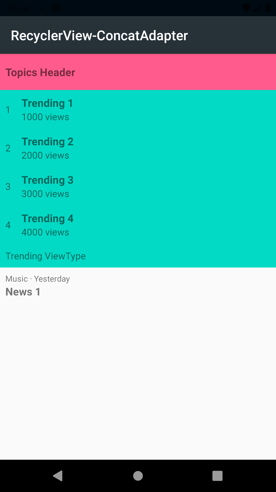

# RecyclerView-MergeAdapter

The main goal is to practice [RecyclerView MergeAdapter](https://developer.android.com/jetpack/androidx/releases/recyclerview#version_120_2) 
a new RecyclerView Adapter that can combine multiple adapters linearly.

## Sample

Do you want to contribute?
--------------------------
Feel free to report or add any useful feature, I will be glad to improve it with your help.

Developed By
------------

* Erik Jhordan Rey  - <erikjhordan.rey@gmail.com> 
